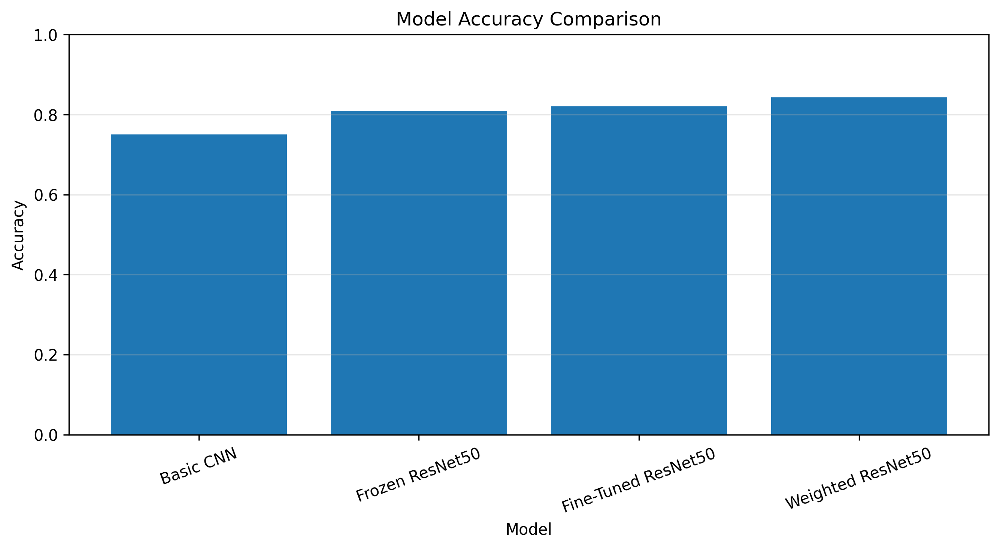
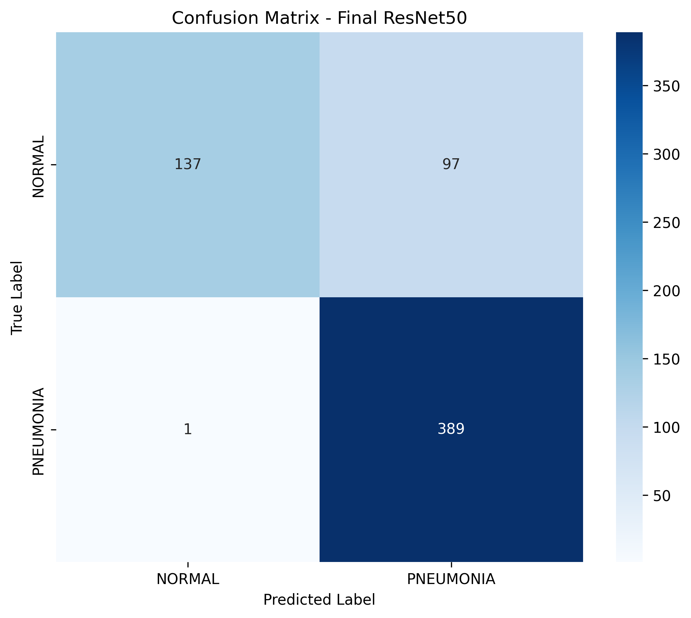
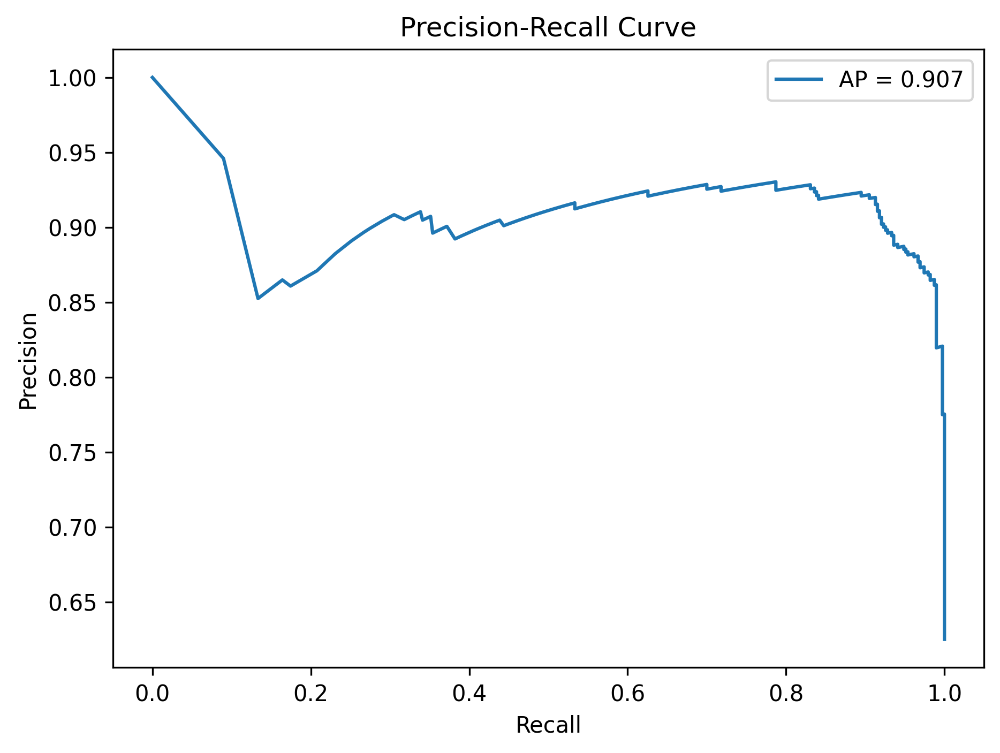
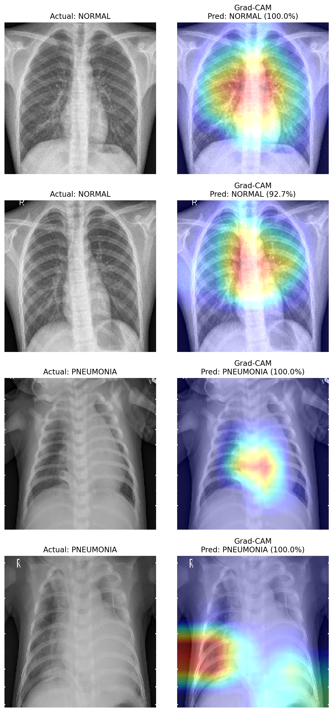
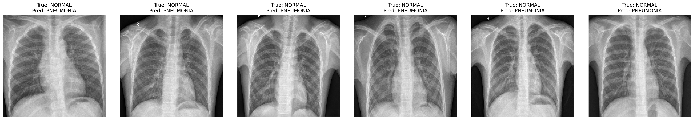

# Chest X-Ray Pneumonia Detection

Deep learning model to detect pneumonia from chest X-ray images using CNN and ResNet50 transfer learning, with Grad-CAM interpretability and a Streamlit demo app.

## Motivation

Pneumonia diagnosis from chest X-rays is time-consuming and requires expert review.
This project explores whether a transfer-learning based CNN can reliably distinguish
NORMAL from PNEUMONIA chest X-rays, and whether the model's decisions can be made
interpretable via Grad-CAM.

## Dataset

- **Source:** [Chest X-Ray Images (Pneumonia) — Kaggle](https://www.kaggle.com/paultimothymooney/chest-xray-pneumonia)
- 5,863 X-ray images (JPEG), organized into `train`, `test`, and `val` folders, each with `NORMAL` and `PNEUMONIA` subfolders.
- Images are anterior-posterior chest X-rays from pediatric patients (ages 1–5), sourced from Guangzhou Women and Children's Medical Center.
- **Known limitation:** the provided `val` split contains only 16 images (8 per class), which is too small for reliable validation.
- **Credit:** Kermany, Daniel; Zhang, Kang; Goldbaum, Michael (2018), "Labeled Optical Coherence Tomography (OCT) and Chest X-Ray Images for Classification", Mendeley Data, V2.

## Approach

Four models were trained and compared:

| Model | Description |
|---|---|
| Basic CNN | 3-block CNN trained from scratch |
| Frozen ResNet50 | ImageNet-pretrained ResNet50 backbone, frozen, custom classification head |
| Fine-tuned ResNet50 | Same as above, with the top layers of ResNet50 unfrozen and fine-tuned |
| Weighted ResNet50 | Fine-tuned ResNet50 trained with class weights to address the ~3:1 PNEUMONIA:NORMAL imbalance |

## Results

| Metric | Value |
|---|---|
| Accuracy |0.842948717948718 |
| Precision |0.8004115226337448 |
| Recall |0.9974358974358974|
| F1 Score |0.8881278538812786|
| ROC-AUC |0.9156695156695156|

## Interpretability (Grad-CAM)

Grad-CAM was used to visualize which regions of each X-ray the model relied on for its prediction, to sanity-check that the model is attending to lung regions rather than spurious artifacts.

## Live Demo

A Streamlit app is included (`app.py`) for interactive predictions with Grad-CAM overlays. Deployed at: _add your Streamlit link here_

## Tech Stack

- Python, TensorFlow / Keras
- ResNet50 (transfer learning)
- scikit-learn (evaluation)
- Streamlit (deployment)
- Google Colab (GPU training)

## Disclaimer

This is an educational/research prototype and is **not** intended for clinical or diagnostic use.
